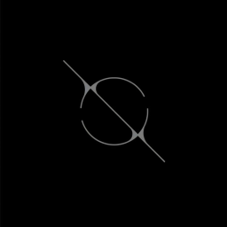

<div align="center">



# Orbit

### Open chat, without the walls.

A simple, modern chat experience built on the **Matrix protocol**.

<p>
  
  
  
  
  
</p>

<p>
  
  
  
  
</p>

<p>
  <a href="https://matrix.org">Matrix</a>
  ·
  <a href="https://github.com/The-Ace-Base/Orbit">Repository</a>
  ·
  <a href="#getting-started">Getting Started</a>
</p>

</div>

---

## ✦ About

Most chat applications keep communication inside a single platform.

**Orbit takes a different approach.**

Orbit is a modern chat client built around the **[Matrix protocol](https://matrix.org/)**, designed to make open, decentralized communication feel simple and familiar.

The technology underneath can be complicated.

**The experience shouldn't be.**

---

## ◉ The idea

Orbit is built around one simple principle:

> **Communication should be open. The experience should be simple.**

Instead of creating another closed messaging ecosystem, Orbit uses Matrix as its communication layer and focuses on the part people actually interact with:

**the experience.**

```text
┌──────────────────────────────────────────┐
│                                          │
│              OPEN NETWORK                │
│                    ↓                     │
│                 MATRIX                   │
│                    ↓                     │
│              SIMPLE CLIENT               │
│                    ↓                     │
│                  ORBIT                   │
│                                          │
└──────────────────────────────────────────┘